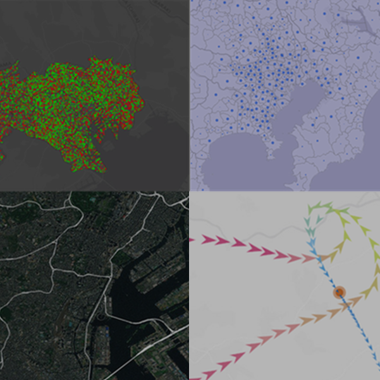

# Data Visualization Workflow with ArcGIS



ArcGIS 開発者向けクラウド サービス（[ArcGIS for Developers]()）で提供されているビジュアライゼーション ツール（マップ ビューアー）を使用した地図上でのデータ可視化のプロセスを紹介します。最終的には地図作成にとどまらず、サードパーティのチャートなどのコンポーネントを組み合わせたアプリ開発をゴールとしています。

本ワークフローで伝える方法はあくまで作成済みのデータに簡単な加工を施して可視化を行うことをクラウド上で実施することを前提としています。よって、デスクトップ GIS ソフトウェアなどを使ったデータ編集は除外しています。

## ワークフロー

５ステップをベースに、各ステップで使用するツールやプラットフォームとその簡単な使用方法を以下で紹介していきます。

1. データ取得
> データ可視化のテーマとなるデータを取得します。

1. データ加工
> 取得したデータを地図上にプロットします。必要に応じてデータ変換を行います。

1. データ処理
> 必要に応じてテーマとなるデータをもとに解析処理を施します。

1. グラフィック表現
> 可視化対象であるデータをテーマに従って表現を加えます。

1. 編集
> ステップ４までに作成した Web マップをページ上に表示し、データ可視化によるテーマを伝えるためにページの編集を行います。

以下は上記５ステップをチャートで表現した図です。必ずしもすべてのステップを踏む必要はなく、また柔軟なアウトプットを行うために開発が担う作業範囲を大きくすることも考えられますが、ここでは、もっとも簡易で効率的な手段として、ステップ４までのプロセスをクラウド上で完了できるようなフローを紹介します。

## データ取得

ArcGIS のクラウド サービスが提供するビジュアライゼーション ツールではさまざまなデータ形式をサポートしており、異なる形式のデータをインポートし、地図上に可視化することができます。

サポートするデータ形式は以下の通りです。

- ArcGIS Web サービス（GeoServices）
- シェープファイル
- GeoJSON
- CSV
- TXT
- GPX
- GeoRSS
- KML
- OGC

上記の形式で座標情報あるいは住所情報があればお好きなデータ カタログから取得したデータをすぐに地図上に可視化できます。特に ArcGIS Web サービスを使うことで、動的な属性/空間検索が可能な API を経由したデータ可視化が可能なため、より柔軟な可視化に対応できます。

以下は、ArcGIS Web サービスを配信しているデータ元の参考です。

- ArcGIS Online
- ArcGIS Open Data
- Koop

## データ加工

ここで紹介するデータ加工はさまざまなデータ形式を１つの地図上に重ねて可視化する作業にあたります。前のステップで取得したデータをデータ ビジュアライゼーション ツールを使って地図上に可視化します。

- ArcGIS Web サービスの場合

- 静的ファイル（シェープファイル、GeoJSON、GPX、GeoRSS、KML）の場合

- テキスト ファイル（CSV、TXT）の場合


> ArcGIS Online で全世界に配信されているデータの検索および可視化

## データ処理

可視化したデータをもとに GIS の空間解析を実施することで、より高度な分析結果を２次データとしてそのまま地図上で扱うことができます。

例：ポイントの集約
> 
>
> たとえば、喫茶店の場所を示すポイント フィーチャと区のエリア フィーチャがあり、喫茶店の売上を区別にまとめるとします。喫茶店に TOTAL_SALES 属性情報があれば、区ごとの TOTAL_SALES の合計値、各区の TOTAL_SALES の最小値または最大値、各区における総売上の標準偏差を取得できます。

このプロセスは必須ではないので、必要に応じて行ってください。

ArcGIS の解析サービスの利用については「[解析の実行 | ArcGIS Online ヘルプ](http://doc.arcgis.com/ja/arcgis-online/use-maps/perform-analysis.htm)」を参照してください。

## グラフィック表現

可視化対象であるデータをテーマに従って表現を加えます。データ ビジュアライゼーション ツールには直感的な操作で地図上のデータの表現を操作するための機能が備わっています。主な表現方法は以下の通りです。

- 場所（単一シンボル）
> 
>
> 単一シンボルを使用してデータを描画すると、フィーチャの分布状態 (クラスター化されているか分散されているか) を把握し、隠れているパターンを明らかにできます。

- ヒート マップ
> 
>
> ヒート マップはレイヤー内のポイントを使用して、マップ上のポイントの相対的な密度を計算し、寒色 (ポイントの密度が低い) から暖色 (ポイントの密度が高い) まで滑らかに変化する一連の色の配列で表示します。

- 種類（個別値シンボル）
> 
>
> 個別値シンボルを使用すると、数値測定の数ではなく、さまざまな種類 (カテゴリ データ) を表示できます。たとえば、さまざまな色を使用して、レストランが提供する料理の種類を表すことができます。レイヤーに表示するカテゴリを 10 種類未満にするのが理想的です。

- 数と量（色）
> 
>
> 数値データが存在する場合、色のグラデーションによってフィーチャを区別できます。使用できる色のグラデーションには、さまざまな種類があります。たとえば、薄い色から濃い色に変化する単純な方式は、年齢や収入など、高低を表すデータ値の表示に適しています。

- 数と量（サイズ）
> 
>
> 数値データまたはランク付けされたカテゴリを表すために、順序付けできる異なるサイズの並びを使用します。この方法を使用して、ポイント、ライン、およびエリアをすべて描画できます。この比例シンボル マップでは、シンボルが大きいほど大きい数値を表すという直感的な論理を使用します。伝えたい内容を明確に表すようにシンボルのサイズを調整します。たとえば、等級シンボルを使用して、各都市の相対的な人口密度を表示できます。

- 色とサイズ
> 
>
> データ内の 2 つの属性を選択し、マップ上のポイント シンボルの色とサイズを完了します。または、同じ属性を 2 回使用して、強調するデータの部分に基づき、シンボルのサイズを設定し、色を設定できます。これは、一人親の世帯数などの数情報を、貧困率などの比率で陰影処理して表示する場合に適したスタイルです。

- 個別値シンボルとサイズ
> 
>
> 学士号を持つ人などの数属性を表示し、郡名など別のフィールドの値ごとに一意の色を使用する場合に使用します。一意の値を持つテキストまたは数値フィールドと、数値フィールドを選択し、必要に応じて、各属性のマップ シンボル設定を調整します。

- A を B と比較
> 
>
> 2 つの数値の比率をマッピングして、その関係をパーセンテージまたは単純な比率で表現できます。たとえば、総人口に対する大学の学位を持つ人の比率をマッピングできます。


> スタイリング機能を使った地図データにもとづくグラフィック表現

## 編集

上記ステップまでに作成した Web マップは１つの完結した地図データとして管理が可能です。Web マップには対応する一意の ID が割り当てられており、JavaScript API を使って ID を参照するだけで可視化した地図をそのまま Web ページ上に表示することができます。


```javascript
var map;
var mapDeferred = arcgisUtils.createMap("<Web マップ ID>", "mapDiv").then(function(response) {
  map = response.map;
});
```

```html
<div id="mapDiv"></div>
```

参照した地図上のデータをスクリプトで取得し、[D3.js](https://d3js.org/) などのサードパーティのチャート コンポーネントと容易に連携が可能です。
